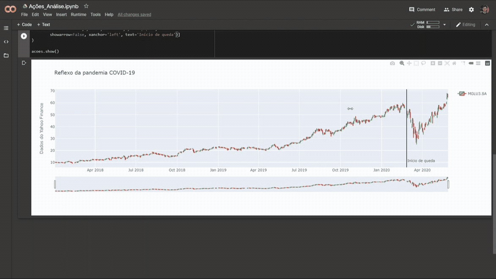

# Exibindo reflexo de performance de empresas da bolsa com a pandemia

## Solução em Python para obter dados do Yahoo Finance, das empresas listadas na bolsa de valores brasileira com destaque para o início do período de pandemia pós-carnaval

#### Python solution to get information from Yahoo Finance on companies listed in brazilian stock market with a mark at the begining of pandemic period in Brazil

###### Libs: Pandas (pandas_datareader), Plotly (graph_objects)
